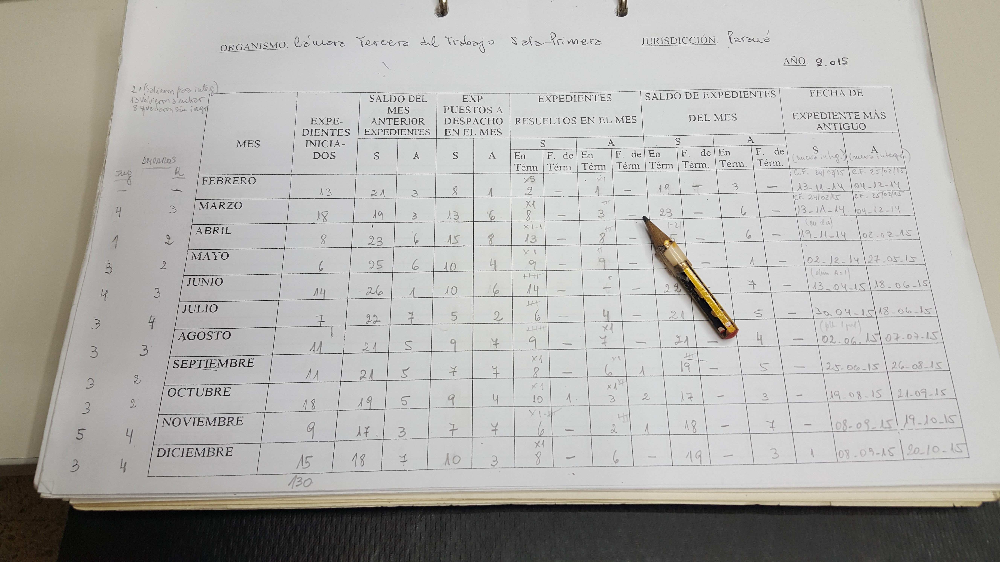
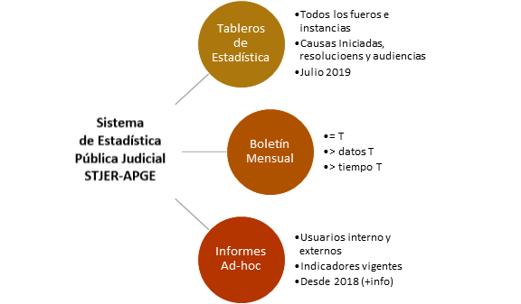
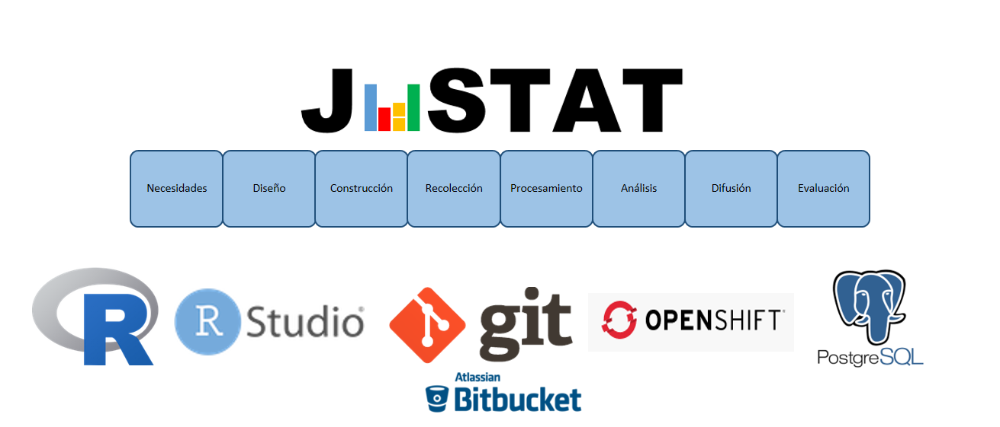

R para Estadística Judicial: Reproducibilidad y Automatización 
========================================================
width: 1920
height: 1080
author: Lic. Sebastián Castillo 
date: 19-10-2021
autosize: true

Presentación
========================================================

+ **Primera Parte**: Introducción   
+ **Segunda Parte**: Trabajo en RMarkdown   
+ **Objetivo:** Completar la elaboración de un informe automatizado y reproducible de estadística judicial.     
+ **materiales_disponibles**: https://github.com/castillosebastian/Taller_R_EstadisticaJudicial.git     

APGE - Desafío
========================================================

<table>
<caption>Estructura Judicial</caption>
 <thead>
  <tr>
   <th style="text-align:left;"> instancia </th>
   <th style="text-align:left;"> materia </th>
   <th style="text-align:right;"> cantidad_organos </th>
  </tr>
 </thead>
<tbody>
  <tr>
   <td style="text-align:left;"> primera_instancia </td>
   <td style="text-align:left;"> civil_com </td>
   <td style="text-align:right;"> 39 </td>
  </tr>
  <tr>
   <td style="text-align:left;"> primera_instancia </td>
   <td style="text-align:left;"> ejecuciones_conc-qui </td>
   <td style="text-align:right;"> 8 </td>
  </tr>
  <tr>
   <td style="text-align:left;"> primera_instancia </td>
   <td style="text-align:left;"> familia </td>
   <td style="text-align:right;"> 31 </td>
  </tr>
  <tr>
   <td style="text-align:left;"> primera_instancia </td>
   <td style="text-align:left;"> laboral </td>
   <td style="text-align:right;"> 15 </td>
  </tr>
  <tr>
   <td style="text-align:left;"> primera_instancia </td>
   <td style="text-align:left;"> paz </td>
   <td style="text-align:right;"> 58 </td>
  </tr>
  <tr>
   <td style="text-align:left;"> primera_instancia </td>
   <td style="text-align:left;"> penal </td>
   <td style="text-align:right;"> 26 </td>
  </tr>
  <tr>
   <td style="text-align:left;"> segunda_instancia </td>
   <td style="text-align:left;"> civil_com </td>
   <td style="text-align:right;"> 7 </td>
  </tr>
  <tr>
   <td style="text-align:left;"> segunda_instancia </td>
   <td style="text-align:left;"> contencioso_adm </td>
   <td style="text-align:right;"> 2 </td>
  </tr>
  <tr>
   <td style="text-align:left;"> segunda_instancia </td>
   <td style="text-align:left;"> laboral </td>
   <td style="text-align:right;"> 5 </td>
  </tr>
  <tr>
   <td style="text-align:left;"> segunda_instancia </td>
   <td style="text-align:left;"> penal </td>
   <td style="text-align:right;"> 2 </td>
  </tr>
  <tr>
   <td style="text-align:left;"> superior_instancia </td>
   <td style="text-align:left;"> civil_com </td>
   <td style="text-align:right;"> 1 </td>
  </tr>
  <tr>
   <td style="text-align:left;"> superior_instancia </td>
   <td style="text-align:left;"> constitucional(apelacion) </td>
   <td style="text-align:right;"> 1 </td>
  </tr>
  <tr>
   <td style="text-align:left;"> superior_instancia </td>
   <td style="text-align:left;"> contencioso_adm </td>
   <td style="text-align:right;"> 1 </td>
  </tr>
  <tr>
   <td style="text-align:left;"> superior_instancia </td>
   <td style="text-align:left;"> laboral </td>
   <td style="text-align:right;"> 1 </td>
  </tr>
  <tr>
   <td style="text-align:left;"> superior_instancia </td>
   <td style="text-align:left;"> penal </td>
   <td style="text-align:right;"> 1 </td>
  </tr>
  <tr>
   <td style="text-align:left;"> Total </td>
   <td style="text-align:left;"> - </td>
   <td style="text-align:right;"> 198 </td>
  </tr>
</tbody>
</table>
-------

**Estadística Descriptiva**

- datos_primarios_xmes = 198 * 4 ≈ 792 (ci,carch,resol,audic,mov)
- procesos = relevamiento, procesesamiento, análisis y producción

**Análisis de Datos**
- datos_primarios: x 
- procesos = necesidad, [diseño-construccion relevamiento], procesamiento, análisis e informe

APGE - Problema
========================================================

Estadística-1982/2016: 30 años ¿problema resuelto?

*"los muertos que vos matáis gozan de buena salud"*

APGE - Una idea simple
========================================================

Donde hay **dato** debe haber **algoritmo**. 

-------

**[Reproducibilidad](https://cure.web.unc.edu/defining-reproducibility/)**: la capacidad de un cálculo para ser replicado por terceros operando de forma independiente.   

**Automatización**: introducción de agentes (ie. algoritmos) autónomos en situaciones que requieren operaciones recurrentes.    

APGE - Productos/Servicios
========================================================

APGE Sistema de Estadística Pública Judicial del STJER
========================================================

+ [INDEC](https://www.indec.gob.ar/).
+ [EUROSTAT](https://ec.europa.eu/eurostat), 2016: Aplicación Modelo Genérico Proc. Estadísticos
+ [R, Official Statistics](https://cran.r-project.org/web/views/OfficialStatistics.html), 2013 +: Publicaciones y Herramientas 
+ [GREP-JUFEJUS Argentina](http://www.jufejus.org.ar/index.php/2013-04-29-21-18-54/estadisticas), 2010 +: Código de Buenas Prácticas de las Estadísticas Judiciales

APGE JUSTAT: arquitectura (pública)
========================================================

Aplicaciones:

+ [Tableros](https://justat.jusentrerios.gov.ar/presentaciones/)  
+ [Presentaciones](https://tablero.jusentrerios.gov.ar/)   

Librerías: 

+ [Operaciones](https://bitbucket.org/apgye/apgyeoperationsjuser/)
+ [Procesamiento](https://bitbucket.org/apgye/apgyeprocesamiento/)
+ [Organización_Institucional](https://bitbucket.org/apgye/apgyejuserorganization/)
+ [Informes](https://bitbucket.org/apgye/apgyeinformes/)

Modelo típico de un "análisis de datos"
========================================================

["R for Data Science"](https://r4ds.had.co.nz/introduction.html), Wickham-Grolemund.

Bibliografia
========================================================

+ [An Introduction to R -Douglas et all, 2021](https://intro2r.com/)   
+ [R for Data Science](https://r4ds.had.co.nz/introduction.html)   

APGE - Agradecimientos
========================================================
Equipo:   
+ Emilce Leones (operador)
+ Marcos Londero (técnico)
+ Sebastián Castillo (director)

Gracias
Área de Planificación Gestión y Estadística    
Superior Tribunal de Justicia de Entre Ríos    
0343-4209405/410 – ints. 396 y 305    
+ apge@jusentrerios.gov.ar  
+ estadistica@jusentrerios.gov.ar   
